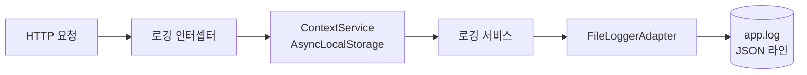
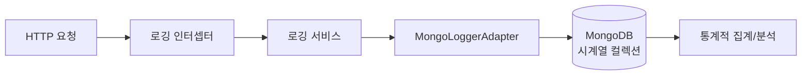
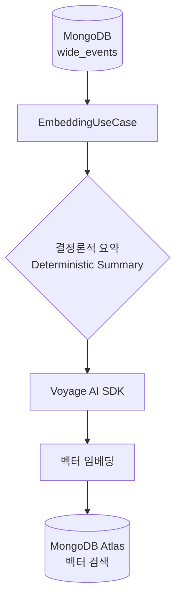
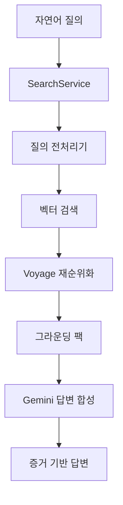
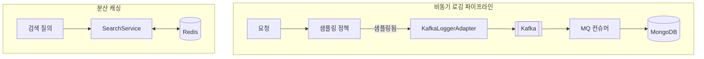

# 맥락 기반 로깅 및 RAG 를 이용한 데이터 조회 시스템

([영문: README.md](README.md))
이 프로젝트는 동일한 맥락을 가진 이벤트들을 포함한 로그데이터를 자연어로 직접 검색할 수 있도록 구현한 프로젝트 입니다.

전통적인 로깅 파이프라인을

- **맥락 기반(Context-aware)의 요청 단위 이벤트 로그(Wide-event)**
- **보안 우선(Security-first)**
- **RAG 기반 분석 플랫폼**으로 점진적으로 발전시키는 (Phase 1 ~ 5) 과정을 담은 로그 관측 시스템을 목표로 구현했습니다.

단순히 디버깅을 위한 텍스트 로그를 남기는 것에 그치지 않고,

- 각 요청을 풍부한 맥락을 가진 1급 이벤트(First-class Event, Wide Event/Canonical Log Line)로 취급했습니다. \
  이를 통해 신뢰성과 감사 가능성을 유지하면서도 분석 수준의 디버깅, 안전한 데이터 조회, 그리고 AI 지원 추론이 가능한 구조를 구현하고자 했습니다.

- 전통적인 텍스트 기반 로깅의 한계를 극복하기 위해, 하나의 요청을 하나의 '와이드 이벤트(Wide Event)'로 취급하고 \
  이를 RAG(Retrieval-Augmented Generation) 파이프라인과 결합하여 점진적으로 발전시키는 과정을 담고 있습니다.

---

## 📖 문서 안내

이 프로젝트의 **기술적 배경, 아키텍처 철학, 개발 동기**에 대한 자세한 내용은 아래 문서를 참조해주세요.

- [**Overview-ko.md (프로젝트 동기 및 배경)**](./OVERVIEW-ko.md)

---

## 🏗️ 프로젝트 구조

```bash
.
├── backend/            # NestJS 서버 소스 코드
│   ├── src/            # 비즈니스 로직 (Payments, Embeddings 등)
│   ├── libs/config/    # 초기화 관련 라이브러리
│   └── libs/logging/   # 핵심 로깅 라이브러리 (Phase 1~5 공통)
├── prompts/            # LLM 응답에 사용되는 프롬프트들
├── docker/             # 인프라 구성을 위한 Docker Compose 파일
├── docs/               # Phase별 상세 설계 문서 (업데이트 중)
├── journals/           # Phase별 회고 문서
├── test_data/          # 테스트 데이터 생성 및 mock 서비스 로직 테스트 요청을 위한 유틸
└── Overview-ko.md      # 프로젝트 철학 및 상세 배경
```

---

## 🚀 빠른 시작

### 1. 요구 사항

- Node.js (v20 이상 권장)
- pnpm
- Docker & Docker Compose (Phase 2~5 인프라용)

### 2. 설치 및 환경 설정

```bash
# 프로젝트 디렉토리로 이동
cd context-aware-logging/backend

# 의존성 설치
pnpm install

# 환경 변수 설정 (.env 파일 생성 및 API 키 입력)
# backend/.env.example 파일을 참고하여 .env 파일을 작성해주세요.
# Phase 3 부터 Gemini API Key, Voyage AI API Key 등이 필요합니다.
```

### 3. 인프라 실행 (Docker)

```bash
cd docker
docker-compose up -d
```

---

## 🛠️ Phase별 활용 가이드 (1단계 ~ 5단계)

이 프로젝트는 총 5단계의 페이즈를 거쳐 완성됩니다. 각 단계를 직접 테스트하며 프로젝트의 개선과정을 경험해볼 수 있습니다.

### Phase 1: 와이드 이벤트 로깅 (Local JSON)



하나의 요청이 어떻게 풍부한 맥락(Context)을 가진 JSON 데이터로 남는지 확인합니다.

- **환경 변수 설정** (.env)

  ```bash
    PORT=3000
    LOG_FILE_PATH=logs/app.log
    # ...(제외)
    STORAGE_TYPE=file
    # ...(제외)
    MQ_ENABLED=false
    # ...(제외)
    SESSION_CACHE_TYPE=memory #인메모리
  ```

- **테스트**: `POST /payments` 엔드포인트로 요청을 보냅니다.
  - 테스트 방법:

    ```bash
      # test_data 디렉토리에 mock 데이터가 담긴 JSON 파일을 생성합니다.

      node run <프로젝트 Root>/test_data/generator.js

      # backend 가 동작 중인 상태에서 mock 데이터를 기반으로 한 `POST /payments` 요청을 2,000 번 (기본) 생성합니다.

      bash <프로젝트 Root>/test_data/run_load_test.sh
    ```

- **결과 확인**: `backend/logs/app.log` 파일에 한 줄의 JSON(Wide Event)이 기록됩니다.

### Phase 2: MongoDB 영속화 및 쿼리



로컬 파일에 저장되던 로그를 MongoDB 시계열 컬렉션에 저장하여 쿼리 가능한 데이터로 전환합니다.

- **환경 변수 설정** (.env)

  ```bash
    PORT=3000
    LOG_FILE_PATH=logs/app.log

    MONGODB_URI=<mongodb 연결 uri)>
    # ...(제외)
    STORAGE_TYPE=mongodb
    # ...(제외)
    MQ_ENABLED=false
    # ...(제외)
    SESSION_CACHE_TYPE=memory #인메모리
    # ...(제외)
  ```

- **사전 준비**:
  - Docker Compose 또는 외부 MongoDB 가 어플리케이션과 연결되어 있어야 합니다.
  - 외부 MongoDB를 사용중이라면 <프로젝트 Root>/docker/mongo/mongodb-init.js 에 Phase 2 단계 까지의 MongoDB 오브젝트가 생성되어 있어야 합니다.
- **테스트 방법**: Phase 1과 동일하게 요청을 발생시킵니다.
- **결과 확인**: MongoDB의 `logs` 컬렉션에 데이터가 적재되었는지 확인합니다.

### Phase 3: RAG 기반 시맨틱 저장 (Vector DB)



로그 데이터를 요약(Summarization)하고 벡터화하여 의미 검색이 가능한 형태로 저장합니다.

- **환경 변수 설정** (.env)

  ```bash
    PORT=3000
    LOG_FILE_PATH=logs/app.log

    MONGODB_URI=<mongodb 연결 uri)>

    # 임베딩 모델 (voyage ai)

    EMBEDDING_MODEL=voyage-3-lite
    EMBEDDING_MODEL_URI=https://api.voyageai.com/v1/embeddings
    EMBEDDING_MODEL_KEY=<voyage ai api 키>
    EMBEDDING_BATCH_CHUNK_SIZE=50 ## For Chunking Texts to Tokens Before Embedding.(If it's needed)

    # 나머진 3 과 동일
  ```

- **사전 준비**:
  - VoyageAI의 API키를 환경변수에 등록해야 합니다.
  - 외부 MongoDB를 사용중이라면 <프로젝트 Root>/docker/mongo/mongodb-init.js 에 Phase 3 단계 까지의 MongoDB 오브젝트가 생성되어 있어야 합니다.
- **테스트 방법**:
  ```bash
  POST /embeddings/batch?limit=<임베딩을 진행할 로그 갯수(정수)>
  ```
- **결과 확인**: Vector DB(Pinecone 또는 Atlas)에 로그의 의미적 벡터가 저장됩니다.

### Phase 4: 지능형 로그 분석 (RAG Search)



자연어로 로그 데이터에 대해 질문하고 AI의 분석 답변을 받습니다.

- **환경 변수 설정** (.env)

  ```bash
    PORT=3000
    LOG_FILE_PATH=logs/app.log

    MONGODB_URI=<mongodb 연결 uri)>

    # 임베딩 모델 (voyage ai)

    EMBEDDING_MODEL=voyage-3-lite
    EMBEDDING_MODEL_URI=https://api.voyageai.com/v1/embeddings
    EMBEDDING_MODEL_KEY=<voyage ai api 키>
    EMBEDDING_BATCH_CHUNK_SIZE=50 ## For Chunking Texts to Tokens Before Embedding.(If it's needed)

    # 자연어 응답 모델 (gemini)
    RETRIEVING_MODEL=gemini-2.5-flash-lite
    RETRIEVING_MODEL_KEY=<gemini 2.5 flash api 키>
    RETRIEVING_MODEL_URI=<gemini 2.5 flash api url>

    # 나머진 3 과 동일
  ```

- **사전 준비**:
  - VoyageAI의 API키를 환경변수에 등록해야 합니다.
  - Gemini flash 2.0의 API키를 환경변수에 등록해야 합니다.
  - 외부 MongoDB를 사용중이라면 <프로젝트 Root>/docker/mongo/mongodb-init.js 에 Phase 4 단계 까지의 MongoDB 오브젝트가 생성되어 있어야 합니다.
- **테스트 방법(예시)**:
  - 의미 검색:

    ```bash
          curl -G "http://localhost:3000/search/ask" \
          --data-urlencode "q=최근에 결제 요청에서 에러가 난 적이 있어?" \
          --data-urlencode "sessionId=test-session"
    ```

  - 세션 영속성 확인(Phase 4 에선 백엔드의 메모리를, Phase 5에선 Redis를 캐시 저장소로 사용합니다.):\

    ```bash
        curl -G "http://localhost:3000/search/ask" \
        --data-urlencode "q=내가 방금 뭐라고 물어봤어?" \
        --data-urlencode "sessionId=test-session"
    ```

  - 통계 검색 (업데이트 중)
    ```bash
        curl -G "http://localhost:3000/search/ask" \
        --data-urlencode "q=최근 24 시간동안 발생한 결제 요청 에러의 빈도를 알려줘" \
        --data-urlencode "sessionId=test-session"
    ```

- **결과 확인**: AI가 실제 로그 데이터 / 캐시에 저장된 세션의 대화내역을 근거로 분석한 답변을 반환합니다.

### Phase 5: 운영 안정화 (Hardening)



Kafka를 통한 로그 수집 디커플링, Redis 캐싱, 샘플링 전략을 통해 시스템을 견고하게 만듭니다.

- **환경 변수 설정** (.env)

  ```bash
    PORT=3000
    LOG_FILE_PATH=logs/app.log

    MONGODB_URI=<mongodb 연결 uri)>


    # 임베딩 모델 (voyage ai)

    EMBEDDING_MODEL=voyage-3-lite
    EMBEDDING_MODEL_URI=https://api.voyageai.com/v1/embeddings
    EMBEDDING_MODEL_KEY=<voyage ai api 키>
    EMBEDDING_BATCH_CHUNK_SIZE=50 ## For Chunking Texts to Tokens Before Embedding.(If it's needed)

    # 자연어 응답 모델 (gemini)
    RETRIEVING_MODEL=gemini-2.5-flash-lite
    RETRIEVING_MODEL_KEY=<gemini 2.5 flash api 키>
    RETRIEVING_MODEL_URI=<gemini 2.5 flash api url>


    # 저장소 설정
    STORAGE_TYPE=kafka ## file, mongodb, kafka

    # Docker Compose
    # MQ 설정
    ## MQ Connection Configurations
    MQ_ENABLED=true
    MQ_TYPE=kafka
    MQ_BROKER_ADDRESS=localhost:9092
    MQ_LOG_TOPIC=log-events
    MQ_CONSUMER_GROUP=log-consumer-group (예시)

    ## MQ 배치 단위, 배치 처리 타임아웃
    MQ_BATCH_SIZE=100
    MQ_BATCH_TIMEOUT_MS=1000

    # Cache 저장소 설정
    ## memory or redis
    SESSION_CACHE_TYPE=redis

    ## Redis 설정
    REDIS_HOST=localhost
    REDIS_PORT=6379

    # 로그 샘플링 설정
    LOG_SAMPLING_NORMAL_RATE=0.01
    LOG_SLOW_THRESHOLD_MS=2000
    LOG_CRITICAL_ROUTES=/payments,/auth
  ```

- **테스트 방법**: 대량의 요청을 보내거나 Kafka 인프라를 일시 정지시켜 폴백(Fallback) 로직이 작동하는지 확인합니다.
- **결과 확인**: 시스템 부하가 조절되고, 장애 상황에서도 로그 유실 없이 안전하게 처리됩니다.

---

## ✨ 작성자

- **orca1001**
