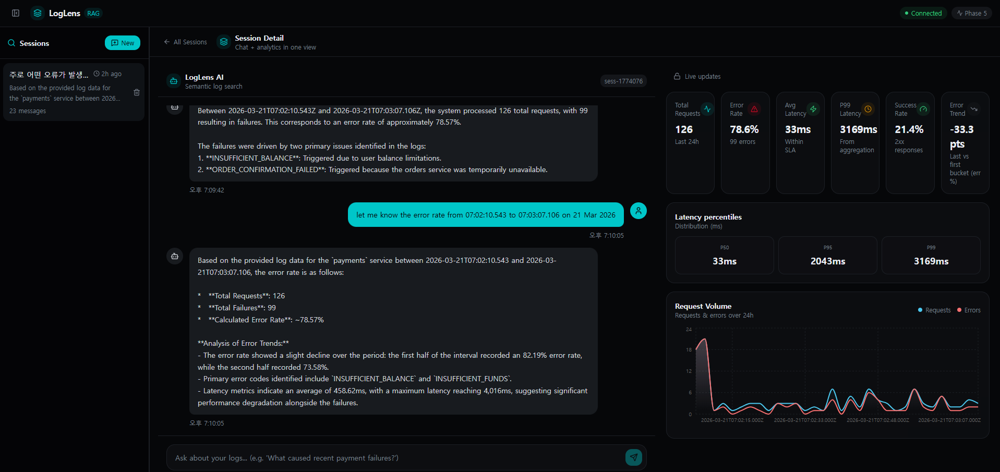
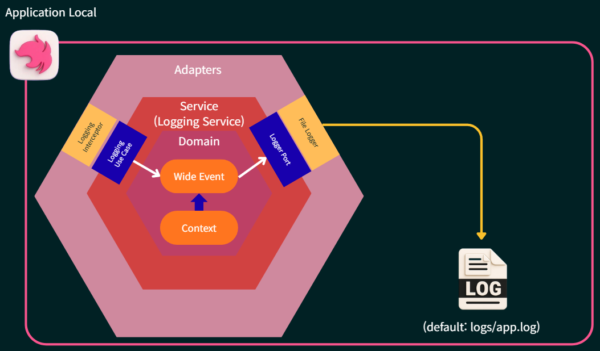
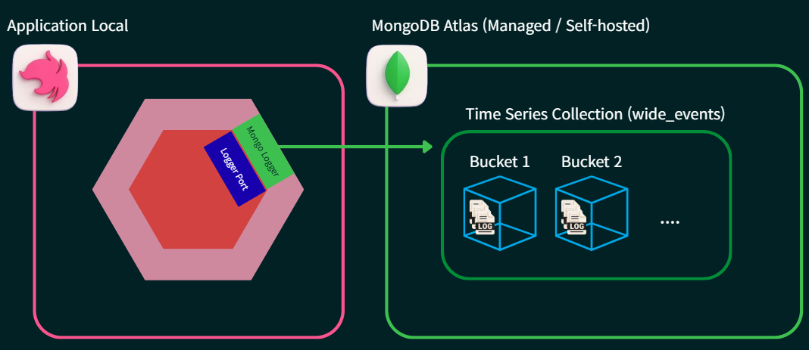
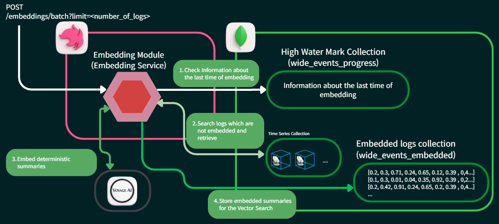
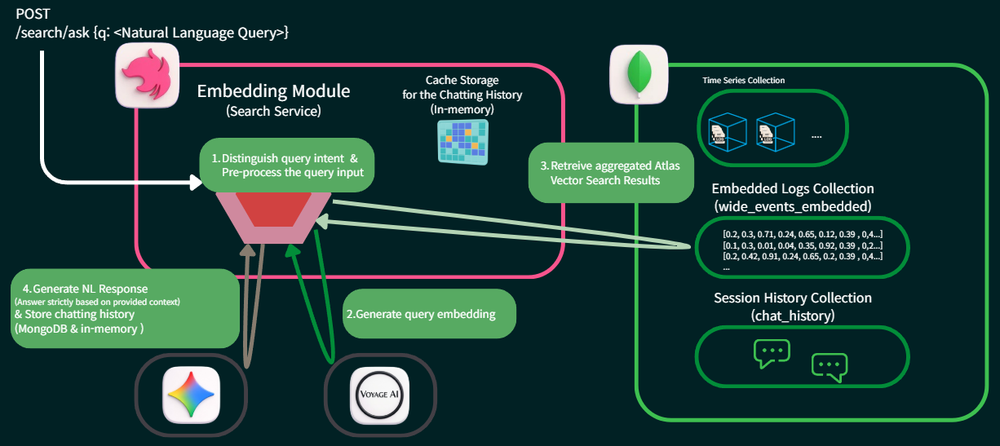
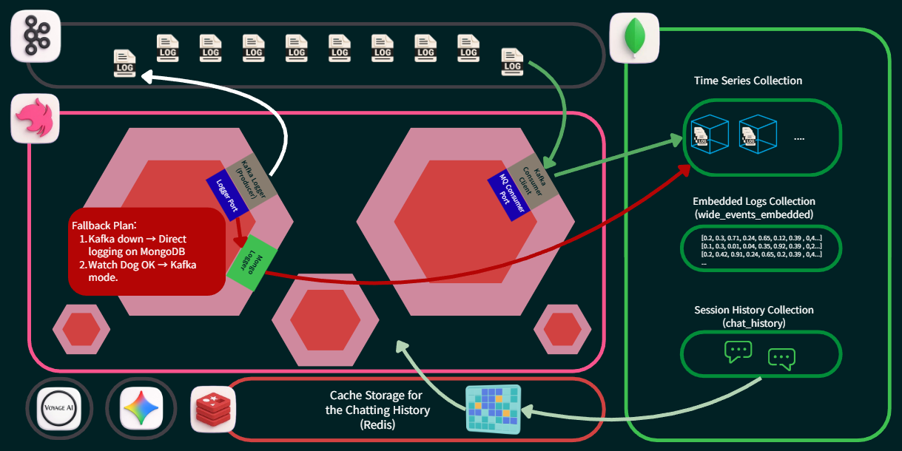

# Context-Aware Logging & RAG Observability System

([Korean: README-ko.md](README-ko.md)) \
This project implements an observability system that enables direct natural language search of log data by preserving and grouping events within the same request context.

It aims to demonstrate the incremental evolution of a traditional logging pipeline into a:

- **Context-aware Wide-event logging system**
- **Security-first platform**
- **RAG-powered analysis platform** (Phases 1 ~ 5).

Beyond simple text-based debugging, this system:

- Treats each request as a **First-class Event (Wide Event / Canonical Log Line)** with rich context, enabling analytics-grade debugging, secure retrieval, and AI-assisted reasoning.
- Combines a **Wide Event** approach with a **RAG (Retrieval-Augmented Generation)** pipeline to overcome the limitations of traditional fragmented logging.

The repository includes a **LogLens** web client (React / Vite) that talks to the Phase 4–5 search API: session-based chat, natural-language questions, and a **live statistics panel** (error rate, latency percentiles, request volume over time, and half-window error trend) grounded in aggregated log data. See **Client UI (LogLens)** below.

---

## 📖 Documentation

For detailed information on the **technical background, architectural philosophy, and motivation**, please refer to the following document:

- [**OVERVIEW.md (Motivation & Background)**](./OVERVIEW.md)

---

## 🏗️ Project Structure

```text
.
├── backend/                 # NestJS API (Payments, Embeddings / search, etc.)
│   ├── src/
│   ├── libs/config/
│   ├── libs/logging/        # Wide-event logging (Phases 1–5)
│   └── prompts/             # LLM prompt templates (classification, synthesis, grounding, …)
├── frontend/                # LogLens UI — React, Vite, Feature-Sliced Design
├── docker/                  # Docker Compose (MongoDB, Kafka, Redis, …)
├── docs/                    # Design notes and screenshots
├── journals/                # Phase retrospectives
├── notes/                   # Short decision logs and task notes
├── test_data/               # Load-test generators and mock traffic
├── OVERVIEW.md              # Motivation and background (English)
└── OVERVIEW-ko.md           # Same (Korean)
```

---

## 🖥️ Client UI (LogLens)



The **LogLens RAG** interface (see [`frontend/`](./frontend/)) provides:

- **Sessions**: Search and open chat sessions; start a new analysis thread.
- **Natural-language queries**: Ask about error rates, latency, or failures; optional **narrow time ranges** (including explicit `start`/`end` timestamps) are passed through query classification so statistics match the requested window.
- **Live updates** (right panel): Summary cards (total requests, error rate, average and P99 latency, success rate), **error trend** (first half vs second half of the window), **latency percentiles** (P50 / P95 / P99), and a **request volume** chart (requests vs errors over time).

For short windows (on the order of minutes), the backend chooses **finer time buckets** so the volume chart shows multiple points instead of a single bar when data exists across the interval.

---

## 🚀 Quick Start

### 1. Requirements

- Node.js (v20+ recommended)
- pnpm
- Docker & Docker Compose (Required for Phases 2~5)

### 2. Installation & Environment Setup

```bash
# Backend (API)
cd backend
pnpm install

# Environment variables: copy from backend/.env.example to .env.
# Gemini and Voyage AI keys are required from Phase 3 onward.

# Frontend (LogLens UI) — optional; set API base URL per frontend config / env
cd ../frontend
pnpm install
```

### 3. Run Infrastructure (Docker)

```bash
cd docker
docker-compose up -d
```

### 4. Run the app (development)

```bash
# Terminal 1 — API (default http://localhost:3000)
cd backend
pnpm run start:dev

# Terminal 2 — LogLens UI (see frontend/README.md for Vite dev server URL)
cd frontend
pnpm run dev
```

---

## 🛠️ Phase-by-Phase Usage Guide (Phase 1 ~ 5)

This project is built across 5 distinct phases. You can experience the system's evolution by testing each phase sequentially.

### Phase 1: Wide Event Logging (Local JSON)



Observe how a single request is captured as a context-rich JSON "Wide Event".

- **Environment Variables** (.env):

  ```bash
  PORT=3000
  LOG_FILE_PATH=logs/app.log
  # ... (other config)
  STORAGE_TYPE=file
  # ... (other config)
  MQ_ENABLED=false
  # ... (other config)
  SESSION_CACHE_TYPE=memory # In-memory
  ```

- **Test**: Generate traffic to the `POST /payments` endpoint.
  - **Execution**:

    ```bash
    # Generate mock data in the test_data directory
    node <Project Root>/test_data/generator.js

    # Generate 2,000 (default) payment requests using the mock data
    bash <Project Root>/test_data/run_load_test.sh
    ```

- **Verification**: Check `backend/logs/app.log` for a single-line JSON event per request.

### Phase 2: MongoDB Persistence & Querying



Transition from local file logs to a queryable MongoDB Time-series collection.

- **Environment Variables** (.env):

  ```bash
  PORT=3000
  LOG_FILE_PATH=logs/app.log

  MONGODB_URI=<your_mongodb_uri>
  # ... (other config)
  STORAGE_TYPE=mongodb
  # ... (other config)
  MQ_ENABLED=false
  # ... (other config)
  SESSION_CACHE_TYPE=memory # In-memory
  # ...
  ```

- **Prerequisites**:
  - Ensure Docker containers or an external MongoDB instance is connected.
  - If using an external DB, ensure schemas for Phase 2 are initialized in `<Project Root>/docker/mongo/mongodb-init.js`.
- **Testing**: Follow the same steps as Phase 1.
- **Verification**: Confirm that log data is populated in the `logs` collection in MongoDB.

### Phase 3: RAG-based Semantic Storage (Vector DB)



Summarize and vectorize log data for semantic search capabilities.

- **Environment Variables** (.env):

  ```bash
  PORT=3000
  LOG_FILE_PATH=logs/app.log

  MONGODB_URI=<your_mongodb_uri>

  # Embedding Model (Voyage AI)
  EMBEDDING_MODEL=voyage-3-lite
  EMBEDDING_MODEL_URI=https://api.voyageai.com/v1/embeddings
  EMBEDDING_MODEL_KEY=<your_voyage_ai_key>
  EMBEDDING_BATCH_CHUNK_SIZE=50 # Chunk size for text processing

  # Other settings same as Phase 2
  ```

- **Prerequisites**:
  - Add your **VoyageAI API Key** to the environment variables.
  - Ensure MongoDB objects for Phase 3 are initialized.
- **Testing**: Trigger the batch embedding process via

  ```bash
  POST /embeddings/batch?limit=<number_of_logs>
  ```

- **Verification**: Verify that semantic vectors are stored in the Vector DB (Pinecone or Atlas).

### Phase 4: Intelligent Log Analysis (RAG Search)



Query your logs using natural language and receive AI-driven insights.

- **Environment Variables** (.env):

  ```bash
  PORT=3000
  LOG_FILE_PATH=logs/app.log

  MONGODB_URI=<your_mongodb_uri>

  # Embedding Model (Voyage AI)
  EMBEDDING_MODEL=voyage-3-lite
  EMBEDDING_MODEL_URI=https://api.voyageai.com/v1/embeddings
  EMBEDDING_MODEL_KEY=<your_voyage_ai_key>
  EMBEDDING_BATCH_CHUNK_SIZE=50

  # LLM (Gemini)
  RETRIEVING_MODEL=gemini-2.5-flash-lite
  RETRIEVING_MODEL_KEY=<your_gemini_api_key>
  RETRIEVING_MODEL_URI=<your_gemini_api_url>

  # Other settings same as Phase 3
  ```

- **Prerequisites**:
  - Add **VoyageAI** and **Gemini Flash 2.0** API Keys to the environment variables.
  - Ensure MongoDB objects for Phase 4 are initialized.
- **Testing**:
  - **Semantic Search**:
    ```bash
      curl -G "http://localhost:3000/search/ask" \
      --data-urlencode "q=What caused the recent payment failures?" \
      --data-urlencode "sessionId=<your-test-session-ID>"
    ```
  - **Session Persistence**: (Note: Phase 4 uses In-memory cache; Phase 5 uses Redis).
    ```bash
      curl -G "http://localhost:3000/search/ask" \
      --data-urlencode "q=What did I just asked you?" \
      --data-urlencode "sessionId=<your-test-session-ID>"
    ```
  - **Statistical / aggregation queries** (error rates, counts, trends — charts and summary cards appear in LogLens when using the UI)
    ```bash
      curl -G "http://localhost:3000/search/ask" \
      --data-urlencode "q=How many failures are happened within 48 hours?" \
      --data-urlencode "sessionId=<your-test-session-ID>"
    ```
- **Verification**: AI returns responses grounded in actual log data and session history. With the **LogLens** UI running, you can run the same flows in the browser and inspect charts and summary cards for statistical answers.

### Phase 5: Production Hardening



Enhance system resilience using Kafka for decoupling, Redis for caching, and sampling strategies.

- **Environment Variables** (.env):

  ```bash
  PORT=3000
  LOG_FILE_PATH=logs/app.log

  MONGODB_URI=<your_mongodb_uri>

  # Embedding Model (Voyage AI)
  EMBEDDING_MODEL=voyage-3-lite
  EMBEDDING_MODEL_URI=https://api.voyageai.com/v1/embeddings
  EMBEDDING_MODEL_KEY=<your_voyage_ai_key>
  EMBEDDING_BATCH_CHUNK_SIZE=50

  # LLM (Gemini)
  RETRIEVING_MODEL=gemini-2.5-flash-lite
  RETRIEVING_MODEL_KEY=<your_gemini_api_key>
  RETRIEVING_MODEL_URI=<your_gemini_api_url>

  # Storage Strategy
  STORAGE_TYPE=kafka # Options: file, mongodb, kafka

  # Docker Compose
  # MQ (Kafka) Configuration
  MQ_ENABLED=true
  MQ_TYPE=kafka
  MQ_BROKER_ADDRESS=localhost:9092
  MQ_LOG_TOPIC=log-events
  MQ_CONSUMER_GROUP=log-consumer-group

  # Batch Processing
  MQ_BATCH_SIZE=100
  MQ_BATCH_TIMEOUT_MS=1000

  # Cache Strategy
  SESSION_CACHE_TYPE=redis # Options: memory, redis

  # Redis Configuration
  REDIS_HOST=localhost
  REDIS_PORT=6379

  # Log Sampling Configuration
  LOG_SAMPLING_NORMAL_RATE=0.01
  LOG_SLOW_THRESHOLD_MS=2000
  LOG_CRITICAL_ROUTES=/payments
  ```

- **Testing**: Simulate high-load scenarios or Kafka downtime to verify the **Direct-to-DB fallback** logic.
- **Verification**: Observe stable load management and zero-data-loss even during infrastructure interruptions.

---

## ✨ Author

- **orca1001**
