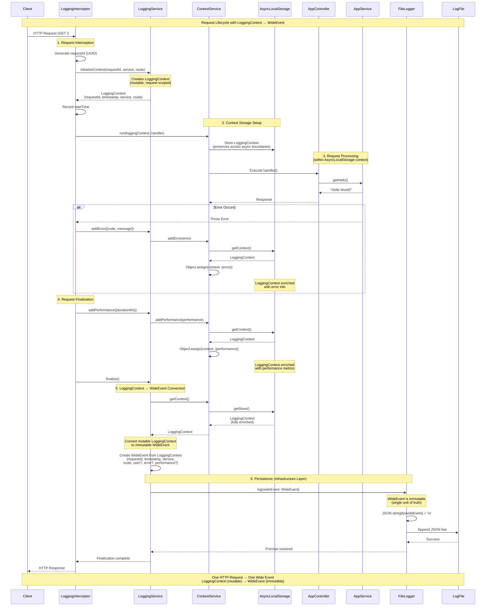

# Phase 1 — Context-Aware Logging with Wide Events

## Goal

Replace line-based logging with request-scoped Wide Events.

## Key Ideas

- One request → one log event
- Logs must capture _what happened_, not _what the code did_

## Implementation Notes

- Use AsyncLocalStorage for request context
- Initialize base fields in middleware
- Enrich context in handlers/services
- Emit exactly one structured log per request

## Anti-Patterns

- Multiple log lines per request
- Logging without requestId
- Logging only error messages without context

## Architecture: LoggingContext vs WideEvent

### The Two-Layer Design

The logging system uses two distinct interfaces that share the same structure but serve different purposes:

- **LoggingContext**: Mutable, request-scoped working context
- **WideEvent**: Immutable, domain contract for persistence

### Why Two Interfaces?

At first glance, `LoggingContext` and `WideEvent` appear identical. However, they represent different concerns:

**LoggingContext (Application Layer)**

- Mutable context enriched throughout the request lifecycle
- Can be extended with internal processing fields (e.g., `_ragEmbedding`, `_ragSummary`)
- Used for tracking intermediate work during request processing
- Lives only during request execution

**WideEvent (Domain Layer)**

- Immutable event structure that must never change
- Single unit of truth across all phases (Phase 1-5)
- Represents what actually happened, not how it was processed
- Persisted to storage systems

### The Conversion Process

```ts
// 1. LoggingContext is created and enriched
const context: LoggingContext = {
requestId: "abc-123",
timestamp: "2025-01-01",
service: "backend",
route: "GET /hello",
// Can be extended with internal fields:
// \_ragEmbedding?: number[],
// \_ragSummary?: string
}

// 2. Converted to WideEvent (only business fields)
const wideEvent: WideEvent = {
    requestId: context.requestId,
    timestamp: context.timestamp,
    service: context.service,
    route: context.route,
    // Internal processing fields excluded
}

// 3. Storage layer adds infrastructure metadata
const mongoDocument = {
    ...wideEvent, // WideEvent preserved as-is
    embedding: context.\_ragEmbedding, // Selected from LoggingContext
    \_id: ObjectId("..."),
    createdAt: new Date()
}
```

### Benefits

**Future-Proof Extensibility**

- New features (RAG, vector search) can extend `LoggingContext` without changing `WideEvent`
- Internal processing fields stay in `LoggingContext`, not persisted in `WideEvent`

**Backward Compatibility**

- `WideEvent` structure remains constant across all phases
- Existing queries, indexes, and analysis tools continue to work
- No migration needed when adding new features

**Clear Separation of Concerns**

- Domain contract (`WideEvent`) is separate from implementation details (`LoggingContext`)
- Storage layer decides what metadata to include, not the domain layer
- Infrastructure can evolve independently

### Example: Phase 3 with Vector Search

When adding vector search capabilities:

```ts
// LoggingContext extends with RAG processing fields
interface LoggingContext {
  // WideEvent fields
  requestId: string
  timestamp: string
  // ...

  // New internal processing fields
  _ragEmbedding?: number[]
  _ragSummary?: string
  _ragProcessing?: {
    /* metadata */
  }
}

// WideEvent remains unchanged
interface WideEvent {
  requestId: string
  timestamp: string
  // ... (no changes)
}

// MongoDB document includes both
const mongoDoc = {
  ...wideEvent, // WideEvent preserved
  embedding: context._ragEmbedding, // Selected from LoggingContext
  summary: context._ragSummary, // Semantic Tagging for embedding
}
```

This design ensures that:

- Natural language queries work via vector search (using `embedding` field)
- Existing structured queries still work (using `WideEvent` fields)
- Past and future logs remain compatible


