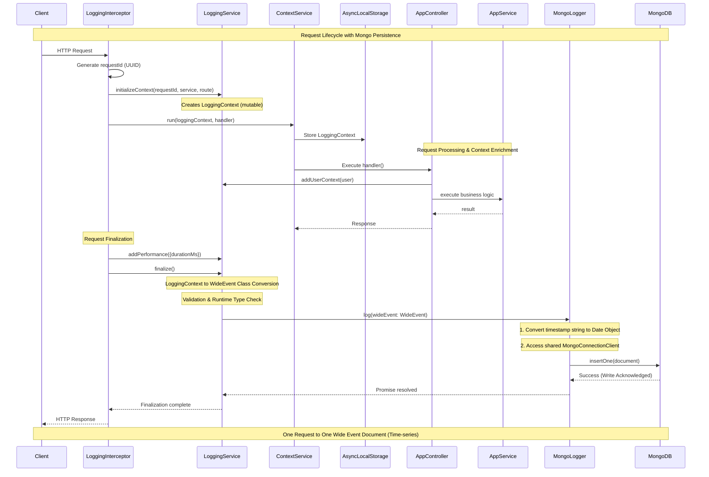

# Phase 2 — Persisting Logs as Data Assets (MongoDB)

## Goal

Treat logs as **queryable data assets**, not just flat files. Transition from sequential file appending to a structured, high-performance database storage that supports complex analysis.

## Key Ideas

- **Storage as a Service**: Swapping the File adapter for a MongoDB adapter without touching application logic.
- **Searchable Cardinality**: Enable fast lookups on high-cardinality fields (user_id, request_id).
- **Time-Aware Storage**: Leverage MongoDB's native Time-series capabilities for efficient log management.

## Design Decisions

### 1. Time-series Collections

To optimize for high-write volume and time-range queries:

- **timeField**: `timestamp` (Standard WideEvent field)
- **metaField**: `service` (Used for grouping and filtering)
- **granularity**: `seconds` (Optimized for typical API request patterns)

### 2. Validation Schema (Strict Core + Lax Metadata)

Ensure data integrity for core fields while allowing domain-specific flexibility:

- **Strict**: `requestId`, `timestamp`, `service`, `route` must follow specific types.
- **Lax**: The `metadata` and `user` objects are open to evolution to support Phase 3+ (RAG, etc.).

### 3. TTL (Time-To-Live) Strategy

- **Hot Storage**: Logs are kept in MongoDB for **30 days** (`expireAfterSeconds: 2592000`).
- **Cold Storage**: (Future) Older logs can be archived to S3 or compressed storage.

## Index Strategy

| Field        | Type   | Purpose                                    |
| :----------- | :----- | :----------------------------------------- |
| `requestId`  | Single | Point lookups for specific request traces  |
| `timestamp`  | TTL    | Automatic data expiration (30 days)        |
| `user.id`    | Single | Analyzing behavior/errors by specific user |
| `error.code` | Single | Monitoring error spikes and types          |

## Implementation Notes

- **Adapter Pattern**: Implement `MongoLogger` in `libs/logging/infrastructure/mongodb`.
- **Date Conversion**: Convert `WideEvent.timestamp` (ISO String) to `Date` object before persisting to leverage MongoDB time-series optimization.
- **Graceful Failure**: If MongoDB is unavailable, the application must still respond (logs can be dropped or buffered).

## Architecture: From Context to Document

```ts
// 1. WideEvent (Domain Contract - Unchanged)
interface WideEvent {
  requestId: string
  timestamp: string // ISO String
  service: string
  // ...
}

// 2. MongoDB Document (Infrastructure Layer)
const mongoDoc = {
  ...wideEvent,
  timestamp: new Date(wideEvent.timestamp), // Converted for Time-series
  _id: new ObjectId(),
}
```

## Query Examples

- **Error Rate by Route**:

```js
db.wide_events.aggregate([...])
```

- **P95 Latency**:

```js
db.wide_events.aggregate([
  {
    $group: {
      _id: '$route',
      p95: {
        $percentile: {
          input: '$performance.durationMs',
          p: [0.95],
          method: 'approximate',
        },
      },
    },
  },
])
```

- **User Impact Analysis**: Find all users who experienced `error.code: "GATEWAY_TIMEOUT"`.

## Success Criteria

1. File logging is replaced by MongoDB without changing `LoggingService`.
2. Logs are automatically deleted after the TTL period.
3. Complex queries (like P95 latency) return results in sub-second time.
4. MongoDB schema validation prevents malformed logs from being stored.

## Sequence Diagram: Phase 2 Request Lifecycle


