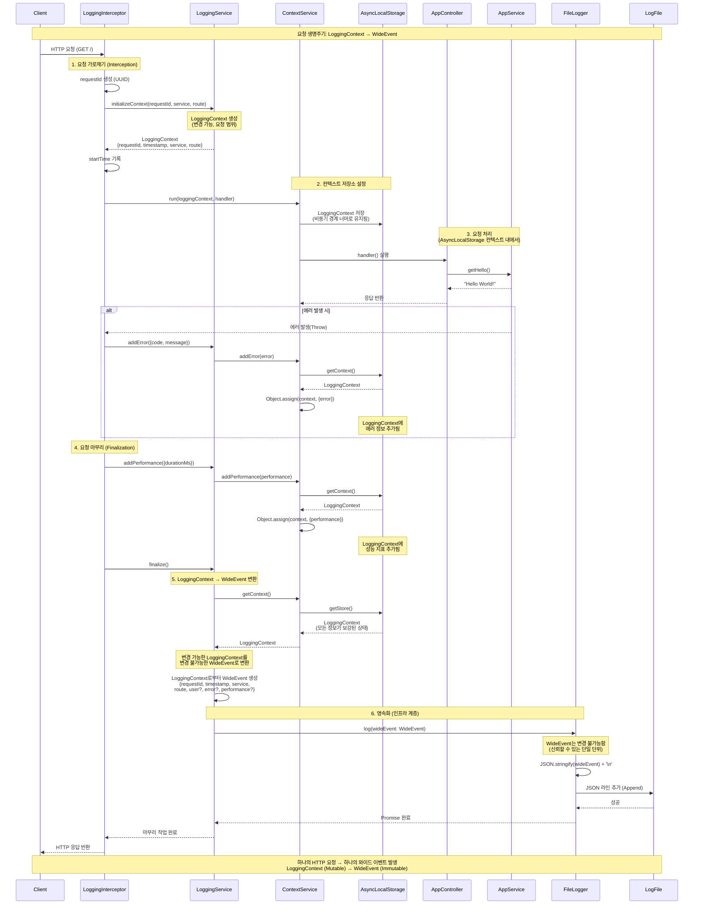

# Phase 1 — 와이드 이벤트를 활용한 맥락 기반 로깅 (Context-Aware Logging)

## 목표

기존의 단순 라인 단위 로깅을 요청 범위(Request-scoped)를 갖는 **와이드 이벤트(Wide Events)** 기반 로깅으로 대체합니다.

## 테스트 데이터 생성 및 테스트 방법

```bash
node run test_data/generator # 'payments_data.json'이라는 이름의 JSON 데이터 파일을 생성합니다.

cd backend

pnpm start:dev

bash ../test_data/run_load_test.sh # 2,000건의 테스트 요청을 보냅니다.
```

## 핵심 아이디어

- **하나의 요청 → 하나의 로그 이벤트**
- 로그는 '코드가 무엇을 했는지'가 아니라, 실제로 **'무슨 일이 일어났는지'**를 담아야 합니다.

## 구현 참고 사항

- 요청 맥락(Context) 관리를 위해 `AsyncLocalStorage`를 사용합니다.
- 미들웨어에서 기본 필드(requestId, timestamp, route 등)를 초기화합니다.
- 핸들러와 서비스 계층에서 맥락 정보를 보강(Enrich)합니다.
- 요청당 정확히 하나의 구조화된 로그만 발행(Emit)합니다.

## 안티 패턴 (지양해야 할 사항)

- 하나의 요청에 대해 여러 줄의 로그를 남기는 행위
- `requestId` 없이 로깅하는 행위
- 맥락 정보 없이 에러 메시지만 로깅하는 행위

## 아키텍처: LoggingContext vs WideEvent

### 2계층 설계 (Two-Layer Design)

이 로깅 시스템은 동일한 구조를 공유하지만 목적이 다른 두 개의 인터페이스를 사용합니다.

- **LoggingContext**: 변경 가능(Mutable)하며, 요청 범위 내에서 유지되는 작업 맥락입니다.
- **WideEvent**: 변경 불가능(Immutable)하며, 영속화를 위한 도메인 규약(Contract)입니다.

### 왜 두 개의 인터페이스가 필요한가요?

`LoggingContext`와 `WideEvent`는 겉보기에 동일해 보일 수 있지만, 서로 다른 관심사를 나타냅니다.

**LoggingContext (애플리케이션 계층)**

- 요청 생명주기 동안 계속해서 정보가 추가되고 변경되는 맥락입니다.
- 내부 처리를 위한 필드(예: `_ragEmbedding`, `_ragSummary`)를 포함할 수 있습니다.
- 요청 처리 중 발생하는 중간 작업들을 추적하는 데 사용됩니다.
- 요청이 실행되는 동안에만 존재합니다.

**WideEvent (도메인 계층)**

- 한 번 생성되면 절대 변경되지 않는 구조를 가집니다.
- 모든 단계(Phase 1-5)에서 신뢰할 수 있는 단일 진실 공급원(Single Unit of Truth) 역할을 합니다.
- '어떻게 처리되었는지'가 아니라 '실제로 무슨 일이 일어났는지'를 나타냅니다.
- 저장소(Storage)에 영속화되는 대상입니다.

### 변환 과정 (The Conversion Process)

```ts
// 1. LoggingContext가 생성되고 정보가 보강됨
const context: LoggingContext = {
  requestId: "abc-123",
  timestamp: "2025-01-01",
  service: "backend",
  route: "GET /hello",
  // 내부 필드 추가 가능:
  // _ragEmbedding?: number[],
  // _ragSummary?: string
}

// 2. WideEvent로 변환 (비즈니스 필드만 포함)
const wideEvent: WideEvent = {
    requestId: context.requestId,
    timestamp: context.timestamp,
    service: context.service,
    route: context.route,
    // 내부 처리용 필드는 제외됨
}

// 3. 저장소 계층에서 인프라 메타데이터 추가
const mongoDocument = {
    ...wideEvent, // WideEvent는 있는 그대로 보존
    embedding: context._ragEmbedding, // LoggingContext에서 필요한 필드만 선택
    _id: ObjectId("..."),
    createdAt: new Date()
}
```

### 기대 효과

**미래 지향적인 확장성**

- `WideEvent`를 변경하지 않고도 `LoggingContext`를 확장하여 새로운 기능(RAG, 벡터 검색 등)을 추가할 수 있습니다.
- 내부 처리용 필드는 `LoggingContext`에만 머물며 `WideEvent`에는 영향을 주지 않습니다.

**하위 호환성 유지**

- `WideEvent` 구조는 모든 단계에서 일정하게 유지됩니다.
- 기존의 쿼리, 인덱스, 분석 도구들을 그대로 사용할 수 있습니다.
- 새로운 기능을 추가할 때 데이터 마이그레이션이 필요하지 않습니다.

**명확한 관심사 분리**

- 도메인 규약(`WideEvent`)과 구현 세부 사항(`LoggingContext`)이 분리됩니다.
- 도메인 계층이 아닌 저장소 계층에서 어떤 메타데이터를 포함할지 결정합니다.
- 인프라 환경이 도메인과 독립적으로 발전할 수 있습니다.

### 예시: 벡터 검색이 추가된 Phase 3

벡터 검색 기능을 추가할 때의 모습입니다.

```ts
// LoggingContext는 RAG 처리 필드를 포함하도록 확장됨
interface LoggingContext {
  // WideEvent 필드들
  requestId: string
  timestamp: string
  // ...

  // 새로운 내부 처리용 필드들
  _ragEmbedding?: number[]
  _ragSummary?: string
  _ragProcessing?: {
    /* 메타데이터 */
  }
}

// WideEvent는 변경되지 않음
interface WideEvent {
  requestId: string
  timestamp: string
  // ... (변경 없음)
}

// MongoDB 문서는 두 정보를 모두 포함
const mongoDoc = {
  ...wideEvent, // WideEvent 보존
  embedding: context._ragEmbedding, // LoggingContext에서 가져옴
  summary: context._ragSummary, // 임베딩을 위한 시맨틱 태깅 정보
}
```

이러한 설계는 다음을 보장합니다.

- 벡터 검색을 통한 자연어 질의 가능 (`embedding` 필드 사용)
- 기존의 구조화된 쿼리 유지 (`WideEvent` 필드 사용)
- 과거 로그와 미래 로그 간의 호환성 유지


