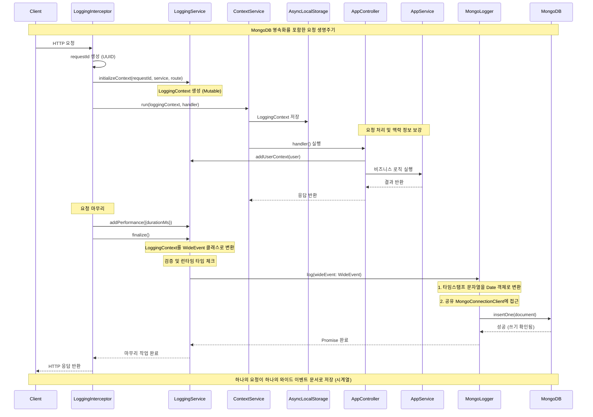

# Phase 2 — 데이터 자산으로서의 로그 영속화 (MongoDB)

## 목표

로그를 단순한 플랫 파일이 아닌 **쿼리 가능한 데이터 자산**으로 취급합니다. 순차적인 파일 추가 방식에서 벗어나, 복잡한 분석을 지원하는 구조화된 고성능 데이터베이스 저장소로 전환합니다.

## 핵심 아이디어

- **서비스로서의 저장소 (Storage as a Service)**: 애플리케이션 로직을 수정하지 않고 File 어댑터를 MongoDB 어댑터로 교체합니다.
- **검색 가능한 고기수(High-Cardinality) 필드**: `user_id`, `request_id`와 같은 고기수 필드에 대해 빠른 조회를 가능하게 합니다.
- **시간 기반 저장소 (Time-Aware Storage)**: 효율적인 로그 관리를 위해 MongoDB의 네이티브 시계열(Time-series) 기능을 활용합니다.

## 설계 결정 사항

### 1. 시계열 컬렉션 (Time-series Collections)

높은 쓰기량과 시간 범위 쿼리를 최적화하기 위해 다음 설정을 사용합니다.

- **timeField**: `timestamp` (표준 WideEvent 필드)
- **metaField**: `service` (그룹화 및 필터링에 사용)
- **granularity**: `seconds` (일반적인 API 요청 패턴에 최적화)

### 2. 검증 스키마 (Strict Core + Lax Metadata)

도메인별 유연성을 허용하면서도 핵심 필드의 데이터 무결성을 보장합니다.

- **Strict (엄격)**: `requestId`, `timestamp`, `service`, `route`는 특정 타입을 반드시 따라야 합니다.
- **Lax (느슨)**: `metadata`와 `user` 객체는 Phase 3 이상의 기능(RAG 등)을 지원하기 위해 유연하게 확장될 수 있습니다.

### 3. TTL (Time-To-Live) 전략

- **Hot Storage**: 로그는 MongoDB에 **30일** 동안 보관됩니다 (`expireAfterSeconds: 2592000`).
- **Cold Storage**: (추후 예정) 오래된 로그는 S3나 압축 저장소로 아카이빙될 수 있습니다.

## 인덱스 전략

| 필드         | 타입   | 목적                                       |
| :----------- | :----- | :----------------------------------------- |
| `requestId`  | 단일   | 특정 요청 트레이스에 대한 포인트 조회      |
| `timestamp`  | TTL    | 데이터 자동 만료 (30일)                    |
| `user.id`    | 단일   | 특정 사용자의 행동 및 에러 분석            |
| `error.code` | 단일   | 에러 급증 및 에러 유형 모니터링            |

## 구현 참고 사항

- **어댑터 패턴**: `libs/logging/infrastructure/mongodb`에 `MongoLogger`를 구현합니다.
- **날짜 변환**: MongoDB의 시계열 최적화를 활용하기 위해 영속화 전 `WideEvent.timestamp` (ISO 문자열)를 `Date` 객체로 변환합니다.
- **우아한 장애 처리 (Graceful Failure)**: MongoDB를 사용할 수 없는 상황에서도 애플리케이션은 응답해야 합니다 (로그는 드롭되거나 버퍼링될 수 있음).

## 아키텍처: 컨텍스트에서 문서로

```ts
// 1. WideEvent (도메인 규약 - 변경 없음)
interface WideEvent {
  requestId: string
  timestamp: string // ISO 문자열
  service: string
  // ...
}

// 2. MongoDB 문서 (인프라 계층)
const mongoDoc = {
  ...wideEvent,
  timestamp: new Date(wideEvent.timestamp), // 시계열 최적화를 위한 변환
  _id: new ObjectId(),
}
```

## 쿼리 예시

- **경로별 에러율**:

```js
db.wide_events.aggregate([...])
```

- **P95 지연 시간 (Latency)**:

```js
db.wide_events.aggregate([
  {
    $group: {
      _id: '$route',
      p95: {
        $percentile: {
          input: '$performance.durationMs',
          p: [0.95],
          method: 'approximate',
        },
      },
    },
  },
])
```

- **사용자 영향도 분석**: `error.code: "GATEWAY_TIMEOUT"`을 경험한 모든 사용자 찾기

## 성공 기준

1. `LoggingService`를 수정하지 않고 파일 로깅이 MongoDB로 대체됨.
2. TTL 기간이 지나면 로그가 자동으로 삭제됨.
3. P95 지연 시간과 같은 복잡한 쿼리가 1초 미만으로 결과를 반환함.
4. MongoDB 스키마 검증을 통해 잘못된 형식의 로그 저장을 방지함.

## 시퀀스 다이어그램: Phase 2 요청 생명주기



